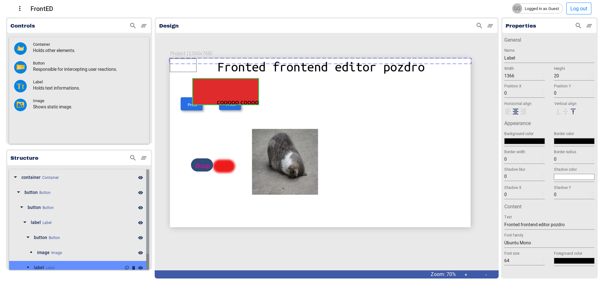

# FrontED
## Modular front-end editor

Supports creating and exporting mockups into HTML.




### Usage
#### Front-end
```bash
cd app/
npm install
npm start
# page starts on localhost:3000 by default
# login into backend service at http://localhost:8000/accounts/login (login:guest pass:fronted123)
# Then on the page (login: guest pass:fronted123)
```


#### Back-end
```bash
cd backend/
pip install -r requirements.txt
cd wwwdaemon/
python manage.py runserver
# service runs on localhost:8000
```


### TO DO
1. Optimizing drag events
1. Gradients in properties
1. Moving elements in hierarchy
1. Resizing elements in Design View
1. Showing list of all user projects
1. Handling user login errors
1. Disabling actions for not-logged-in users
1. Adding more export options (Android?)
1. Seamlessly moving elements from Controls into Design
1. Grid and snap to grid option
